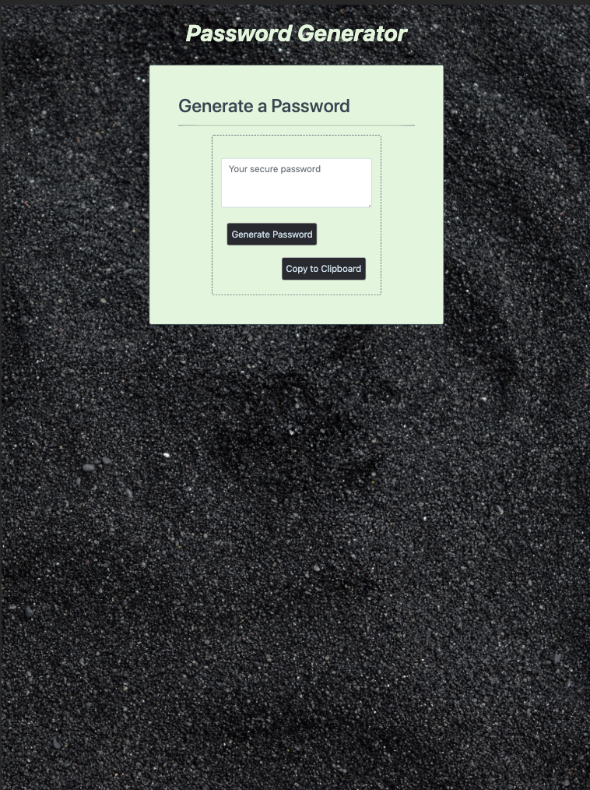
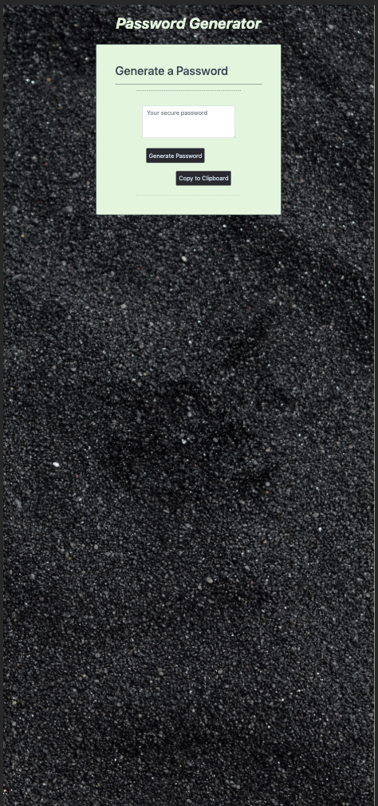

# JT Turner's Password Generator README

##Links to deployed application
Github Pages: https://github.com/javierturner/passwordgenerator
Deployed Application: https://javierturner.github.io/passwordgenerator/index.html

##Installation

There is no installation required for this project.

##Usage

The purpose of this was to demonstrate my understanding of basic javascript alerts and functions, all while making a functioning and responsive website.

##Functionality
This website functions by giving the user prompts and alerts, beginning with asking the user how many characters they would like in their password. If the user enters a number less than 8 or greater than 128, then it will refresh the page and make them enter a number that falls between 8 and 128. Once an acceptable number is entered, the website will ask the user if they want to include any other variables. 

From there, the selected variables will be thrown into an empty container, then pull random characters from that string. Once the user clicks the generate button, the string of random characters will be entered into the text box. The user then has the option to press the "Copy to clipboard" button, then they can paste it wherever they need to. 

##Credits

° https://www.youtube.com/watch?v=9sT03jEwcaw
° https://www.w3schools.com/css/css_image_transparency.asp
° https://developer.mozilla.org/en-US/docs/Web/JavaScript/Reference/Global_Objects/parseInt
° https://www.webfx.com/blog/web-design/responsive-background-image/

##Screenshots of completed application

##License

MIT License

Copyright (c) 2019 Javier Turner

Permission is hereby granted, free of charge, to any person obtaining a copy
of this software and associated documentation files (the "Software"), to deal
in the Software without restriction, including without limitation the rights
to use, copy, modify, merge, publish, distribute, sublicense, and/or sell
copies of the Software, and to permit persons to whom the Software is
furnished to do so, subject to the following conditions:

The above copyright notice and this permission notice shall be included in all
copies or substantial portions of the Software.

THE SOFTWARE IS PROVIDED "AS IS", WITHOUT WARRANTY OF ANY KIND, EXPRESS OR
IMPLIED, INCLUDING BUT NOT LIMITED TO THE WARRANTIES OF MERCHANTABILITY,
FITNESS FOR A PARTICULAR PURPOSE AND NONINFRINGEMENT. IN NO EVENT SHALL THE
AUTHORS OR COPYRIGHT HOLDERS BE LIABLE FOR ANY CLAIM, DAMAGES OR OTHER
LIABILITY, WHETHER IN AN ACTION OF CONTRACT, TORT OR OTHERWISE, ARISING FROM,
OUT OF OR IN CONNECTION WITH THE SOFTWARE OR THE USE OR OTHER DEALINGS IN THE
SOFTWARE.